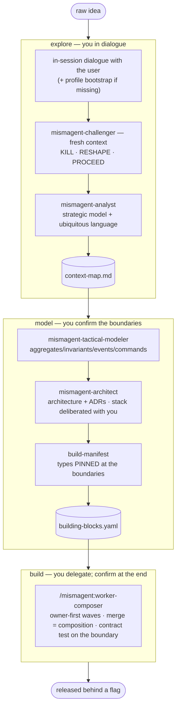

# mismAgent

**An agentic development methodology in three movements — packaged as a Claude Code plugin.**
It is not a methodology to read: it is a flow to invoke. Its substance is the agents and skills
themselves — *their instructions are the process*.

mismAgent sits between two extremes: working **by hand** (high quality only while you babysit every
turn, nothing survives the session) and a **heavy framework** (fixed ceremony you pay even for a
small feature). Its bet: **the only legitimate ceremony is the one the architecture requires** — no
role or template decides it, the *boundary* does. The weight **scales with the case**: a single-side
project pays almost nothing; a multi-side one pays for the boundary that genuinely crosses a deploy.

---

## The flow: explore → model → build



- **explore** — *you in dialogue.* A raw idea becomes an understood problem. A fresh-context
  **challenger** tries to demolish it first; an **analyst** models the strategic boundaries and fixes
  the **ubiquitous language** (the canonical names everything downstream inherits).
- **model** — *you confirm the boundaries.* The tactical model (aggregates, invariants, events,
  commands) becomes a **building-block manifest** with the boundary **types pinned**. Foundational
  decisions (stack, language) are **deliberated with you**, never emitted in a silent ADR.
- **build** — *you delegate, confirm only at the end.* The **worker-composer** reads the manifest and
  *composes*: it builds the boundary owners first, the consumers in parallel, keeps every block green
  on its own, and welds each boundary with a contract test at merge time.

See [`plugins/mismagent/methodology/mismagent.md`](plugins/mismagent/methodology/mismagent.md) for
the full map and the run-sheet (who types what), and
[`plugins/mismagent/redesign/composer-spec.md`](plugins/mismagent/redesign/composer-spec.md) for the
design rationale of the architecture-driven build.

## The ideas that hold it together

- **State = the folder.** A task/block's status *is* its directory (`todo/ doing/ done/`); only the
  worker-composer moves it. No status fields to drift.
- **The boundary is executable.** Every boundary carries pinned types (Published Language) + a
  contract test — invariant tests on an aggregate, consumer-driven tests on a port. The "contract"
  is the contract test on a Bounded-Context boundary; OpenAPI is just its *cross-deploy projection*,
  present only when the boundary crosses a deploy unit.
- **The build composes, it doesn't orchestrate.** `git merge` *is* the composition; the contract
  test runs on the merge result. No conductor, no epics — the seam is everything, the order almost
  nothing.
- **Every cross-movement handoff is a file**, never just a message — movements may run in different
  sessions.
- **No artifact that no machine downstream reads.** If an output has no consumer, it isn't written.
  *(One exception: a **derived view regenerated from a source** — e.g. the human-facing `tasks/`
  view from the manifest — whose consumer is the human; allowed because it's never hand-edited, so
  it can't drift.)*

## Core + profile

The core names **no project**. Each project supplies a `profile.md` (default `.mismagent/profile.md`)
that binds the abstractions to reality: the sides (independent deploy units), their repos and gate
commands, the boundary projections, the commit format. Reuse the method elsewhere by writing a new
profile — see [`plugins/mismagent/PROFILE.md`](plugins/mismagent/PROFILE.md) (template) and
[`plugins/mismagent/profiles/example.md`](plugins/mismagent/profiles/example.md) (a filled-in
fictional instance).

## Kernel + modules by necessity

- **`plugins/mismagent`** — the **kernel**: explore, model, the worker-composer, and the worker's
  skill-matrix (`realize-*` block types × `seam-in-process`). Enough on its own for a single-side
  project.
- **`plugins/mismagent-cross-deploy`** — a module enabled **only when** a boundary crosses a deploy
  unit: the port projects into OpenAPI + generated types + CDC (`seam-cross-deploy`,
  `create-contract`).
- **`attic/`** — the superseded file-driven flow, kept out of the plugin registry on purpose (a
  loaded superseded piece is a zombie in waiting). The history is in `git log`.

## Install (local marketplace)

The repo root is the marketplace. Register it with an **absolute path** (a relative one is read as a
GitHub repo):

```
/plugin marketplace add /absolute/path/to/this/repo
/plugin install mismagent@mismagent-method
/plugin install mismagent-cross-deploy@mismagent-method   # only for cross-deploy boundaries
/reload-plugins
```

Skills and commands are namespaced: `/mismagent:explore`, `/mismagent:worker-composer`, … Agents
are also reachable as **`/mismagent:<name>`** (a thin command that dispatches the `mismagent-<name>`
subagent — e.g. `/mismagent:architect`), or just ask the assistant to dispatch them. Start a feature with
`/mismagent:explore <your idea>`.

