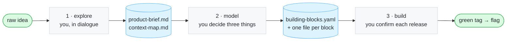

# mismAgent

**An agentic development methodology in three movements — packaged as a Claude Code plugin.**

Not a methodology to read: a flow to invoke. Three commands take a raw idea to merged, tested code,
and the only ceremony you pay is the one your architecture actually requires.


```mermaid
flowchart LR
    idea([raw idea]) --> EX["1 · explore<br/>you, in dialogue"]
    EX --> f1[("product-brief.md<br/>context-map.md")]
    f1 --> MO["2 · model<br/>you decide three things"]
    MO --> f2[("building-blocks.yaml<br/>+ one file per block")]
    BU["3 · build<br/>you confirm each release"] --> done([green tag → flag])
    f2 --> BU

    classDef step fill:#f6f8fa,stroke:#d0d7de,color:#24292f
    classDef file fill:#ddf4ff,stroke:#54aeff,color:#24292f
    classDef term fill:#dafbe1,stroke:#2da44e,color:#24292f
    class EX,MO,BU step
    class f1,f2 file
    class idea,done term
```

## Start here

The repo root is the marketplace. Register it with an **absolute path** — a relative one is read as
a GitHub repo:

```
/plugin marketplace add /absolute/path/to/this/repo
/plugin install mismagent@mismagent-method
/reload-plugins
```

Then, on a feature:

| You type | What happens |
|---|---|
| `/mismagent:explore <idea in one sentence>` | You dialogue, the challenger attacks, the analyst fixes the names. |
| `/mismagent:model <feature>` | Stops exactly three times — ambiguities, stack/style/infra, `tests_nl` — then emits the manifest with boundary types pinned. |
| `/mismagent:worker-composer <feature>` | The build: the **only** command that merges. Blocks **build in parallel** (each in its worktree) and **integrate one at a time**: review → candidate merge → gate + contract tests → promote, so the integration line is never red. The flow runs on a deterministic tool (`tools/mismagent.py`: lint, ready, pack, diff-range, proofs, compose); **in doubt the composer stops and asks** instead of guessing. Loop-safe — run it under `/loop`. Each dispatch runs on a model routed by its action; review depth follows the block type. Only HIGH findings go back to rework (max two cycles, counted from `rework/` files); MED/LOW land in `pre-release.md`, which a release must empty. |
| `/mismagent:board [feature]` | Live read-only kanban. State *is* the folder; parked blocks show as ⏳. |

You step in when a block parks with an open question, and at each release: confirm it → green tag
→ feature flag on. Releases are planned in the manifest: R0 is a thin vertical slice that opens the
app within the first few waves, and the risks the product depends on run as spikes at wave 0,
alongside the scaffold. When something jams, write it in the project's `MISMAGENT-LOG.md` the moment
it happens — the method matures from those logs.

## The three movements

- **explore** — *you in dialogue.* A raw idea becomes an understood problem. A fresh-context
  **challenger** tries to demolish it first; a **researcher** is dispatched only if the domain is
  new; an **analyst** models the strategic boundaries and fixes the **ubiquitous language**, the
  canonical names everything downstream inherits.
- **model** — *you confirm the boundaries.* One command conducts the movement and stops only at the
  three human checkpoints: the tactical ambiguities, the stack/architecture/infra deliberation
  (never a silent ADR), and the **`tests_nl`** — the tests you state in natural language. Out: a
  building-block manifest with the boundary **types pinned**.
- **build** — *you delegate.* The worker-composer reads the manifest and *composes*: boundary owners
  first, consumers in parallel, every block green on its own (D1), each boundary welded by a
  contract test at merge time (D2). An ambiguity doesn't stall the run — the block **parks** in
  `open-questions/`, you answer whenever, the next firing resumes.

Yellow is where the flow stops for you. Everything else runs delegated.


```mermaid
flowchart LR
    subgraph EX["1 · explore"]
        direction TB
        dlg["dialogue<br/>with you"]
        chal["challenger<br/>fresh context,<br/>demolishes the idea"]
        ana["analyst<br/>contexts +<br/>ubiquitous language"]
        dlg --> chal
        chal -. "KILL /<br/>RESHAPE" .-> dlg
        chal -- PROCEED --> ana
    end

    subgraph MO["2 · model"]
        direction TB
        tact["tactical-modeler<br/>aggregates ·<br/>invariants · events"]
        ux["ux-designer<br/>only if there is UI"]
        arch{{"architect, two-pass<br/>stack · style ·<br/>infra · rules"}}
        bman{{"build-manifest<br/>types pinned ·<br/>tests_nl"}}
        tact --> ux --> arch --> bman
    end

    subgraph BU["3 · build"]
        direction TB
        waves["owner-first waves<br/>worker ×N,<br/>one worktree each"]
        park{{"parks in<br/>open-questions/<br/>you answer, it resumes"}}
        d1["D1 — green on its own<br/>verifier (+ review, deep blocks)<br/>+ render proof"]
        d2["D2 — merge composes<br/>contract test<br/>welds the boundary"]
        waves --> d1 --> d2
        waves -. BOUNCED .-> park
    end

    ana == "product-brief.md<br/>context-map.md" ==> tact
    bman == "building-blocks.yaml<br/>+ one file per block" ==> waves
    d2 --> conf{{"you<br/>confirm"}} --> done([green tag<br/>→ flag])

    classDef human fill:#fff8c5,stroke:#d4a72c,stroke-width:2px,color:#24292f
    classDef step fill:#f6f8fa,stroke:#d0d7de,color:#24292f
    classDef term fill:#dafbe1,stroke:#2da44e,color:#24292f
    classDef movement fill:#ffffff,stroke:#afb8c1,stroke-dasharray:4 3,color:#57606a
    class arch,bman,park,conf human
    class dlg,chal,ana,tact,ux,waves,d1,d2 step
    class done term
    class EX,MO,BU movement
```

Watch a run live with `/mismagent:board`.

## The seven agents

Each is also invocable directly as **`/mismagent:<name>`**.

| Agent | Movement | Function |
|---|---|---|
| `challenger` | explore | Fresh-context **adversary**: wrong problem, unverified assumptions, gold-plating, feasibility → verdict `KILL / RESHAPE / PROCEED`. Read-only. |
| `researcher` | explore | Gathers domain material *per feature* — prior art, constraints, real terminology. Dispatched only when the domain is new. |
| `analyst` | explore | The **strategic** level: bounded contexts, relationships, **ubiquitous language**. |
| `tactical-modeler` | model | The **tactical** level per context: aggregates, invariants, domain events, commands. Unknowns become spike nodes. |
| `architect` | model | Architecture + ADRs, **guarantor of the boundaries**. Stack, style, infra and the code-writing rules deliberated **with you** (two-pass); mechanical constraints point to a versioned check the gate runs (`enforced_by`). Leaves ADRs ↔ context-map reconciled. |
| `worker` | build | Realizes **one building block** in its own worktree — skills = its block type, plus the side's memory — TDD until green. Returns `BOUNCED` on ambiguity instead of inventing. |
| `verifier` | build | Fresh-context **structural gate** before merge: real diff from the merge-base, gate re-run, AC coverage, the ADRs' versioned checks, anti-shadow types, render check. Read-only. |

## The ideas that hold it together

mismAgent sits between two extremes: working **by hand** — high quality only while you babysit every
turn, and nothing survives the session — and a **heavy framework**, whose fixed ceremony you pay even
for a small feature. Its bet: **the only legitimate ceremony is the one the architecture requires**.
No role and no template decides it, the *boundary* does.

- **State = the folder.** A block's status *is* its directory (`todo/ doing/ done/`); only the
  worker-composer moves it. No status fields to drift. A bounced block parks as a **file**
  (`open-questions/<id>.md`) — visible, never lost, cleared by regeneration.
- **The boundary is executable.** Every boundary carries pinned types (Published Language) plus a
  contract test — invariant tests on an aggregate, consumer-driven tests on a port. Its network
  form, if any, is a project choice (ADRs, gate).
- **The build composes, it doesn't orchestrate.** `git merge` *is* the composition; the contract
  test runs on the merge result. No conductor, no epics — the seam is everything, the order almost
  nothing.
- **Every cross-movement handoff is a file**, never just a message — movements may run in different
  sessions.
- **No artifact that no machine downstream reads.** If an output has no consumer, it isn't written.
  *(One exception: a derived view regenerated from a source — the rich block files, the read-only
  board — whose consumer is the human. Allowed because it's never hand-edited, so it can't drift.)*

## Core + profile

The core names **no project**. Each project supplies a `profile.md` (default `.mismagent/profile.md`)
binding the abstractions to reality: the sides (code and verification scopes inside the repo),
their paths and gate commands, the commit format. Reuse the method elsewhere by writing a new
profile — see [`PROFILE.md`](plugins/mismagent/PROFILE.md) (template) and
[`profiles/example.md`](plugins/mismagent/profiles/example.md) (a filled-in fictional instance).

The profile is the project's **junction point**: written once, read by every feature. Around it,
`<output_dir>` has a project **trunk** and one folder per feature — a feature is added and thrown
away without touching anything above it.

```
.mismagent/
  profile.md            # the junction point — sides (paths), gate, commit format
  context-map.md        # bounded contexts + ubiquitous language + relationships
  architecture.md       # style + module map + allowed dependency directions
  code-rules.md         # the deliberated rules, each with its enforcement channel
  infra-notes.md        # the deploy/infra context
  decisions/            # ADRs — scope: global | <side> | infra
  architetture/         # architecture overview · dev-architecture per codebase
  features/
    <feature>/          # brief · tactical-model · manifest · blocks · open-questions · proofs
```

A signal is read at the **scope of the artifact it guards**. A new feature's folder is empty by
construction, so emptiness there says nothing about whether the project has chosen its stack: the
foundational deliberation happens **once per project**, the ubiquitous language is **amended** in
the one context map rather than re-forked, and changing a foundational decision is an explicit
amendment (a superseding ADR) rather than a silent rewrite. The same rule fixes what the *second*
feature inherits: the gate's red-green proof and the infra notes are project facts, a contract
belongs to the **boundary** (the file the feature that introduced it opened, extended ever after),
and an open spike carries the `owner:` of the feature that raised it — so a check never mistakes
another feature's work for a gap in yours.

> **v0.13.0 changes this layout (breaking); v0.19.0 is the current version.** Before, everything
> (the context map included) lived in `<output_dir>/<feature>/`, so a second feature forked the
> ubiquitous language and re-deliberated the stack. No shim: in an existing project,
> move `context-map.md`, `decisions/`, `architetture/` and `infra-notes.md` up to the `<output_dir>`
> root, move the rest under `features/<feature>/`, and reconcile by hand if two features had
> diverging context maps. Add an `owner:` to each open spike in the context map — v0.13.1 requires
> it; an entry without one is reported, never acted on.
>
> **v0.16.0 (breaking for a build in progress):** one repository per project — a side is a path inside
> it (`path:` replaces `repo:` in the profile, `gate_files:` added); `dispatch.log` is no longer read —
> the build's state is the block folders plus `rework/`, `review-proof/`, `integrated/`.
>
> **v0.17.0:** prompts cut from ~35k to ~21k words (budgets enforced by a test); an ADR's `enforced_by` is
> `[{check: <repo path>, from: <block>}]` — a versioned check the gate runs; a legacy grep string is
> reported, never executed. Optional `gate_verify:` per side forces the tests to run for the verifier.
> The design rationale moved to `docs/rationale/` (not read by the agents).
>
> **v0.18.0:** one plugin; cross-deploy is gone (module, `create-contract`, `seam-*`, manifest
> `projection`, `contract_*`, `operation_ids`, `schema_paths`, `delivery`). Such contracts stay project
> files: rules in ADRs, `code-rules.md`, dev-architecture; checks in the gate. Uninstall
> `mismagent-cross-deploy`, drop retired fields; `install.sh` removes retired skills.
>
> **v0.19.0:** decision notes — each non-obvious choice (hypothesis, check, debate, who decided) lands in
> `features/<feature>/decisions.md`, checked by `mismagent.py why check` and `lint`, summarized in the pack; features are archived, never deleted.

## Going deeper

- [`methodology/mismagent.md`](plugins/mismagent/methodology/mismagent.md) — the full map of the flow
  and the run-sheet: who types what, in what order.
- [`docs/rationale/composer-spec.md`](docs/rationale/composer-spec.md) — the (non-normative) design rationale
  of the architecture-driven build.
- [`docs/PACKAGING.md`](docs/PACKAGING.md) — the plugin, the supporting skills the flow
  invokes, the generated packagings for Codex and pi, and the guards that keep them aligned.

## Working on this repo

- `python3 -m unittest discover -s plugins/mismagent/tools/tests` — the tool's tests, including a check
  that every `MM …` command in the prompts is runnable as written.
- `.githooks/pre-commit` regenerates `codex/` and `pi/` whenever `plugins/` changes
  (`git config core.hooksPath .githooks` once per clone).
- `.claude/settings.json` adds a Claude Code hook that refuses an agent's `git commit` without a
  `README.md` update in the same commit — `[skip-readme]` in the message opts out when nothing a
  reader sees has changed.
