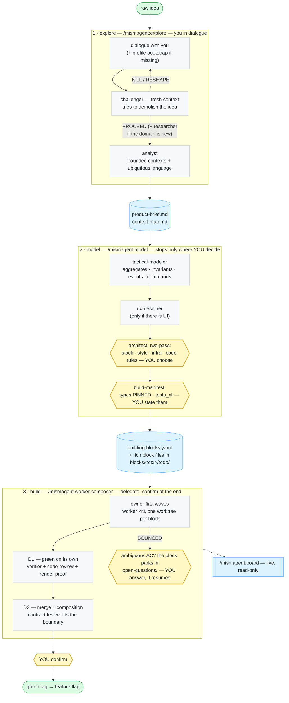

# mismAgent

**An agentic development methodology in three movements — packaged as a Claude Code plugin.**
It is not a methodology to read: it is a flow to invoke. Its substance is the agents and skills
themselves — *their instructions are the process*.

mismAgent sits between two extremes: working **by hand** (high quality only while you babysit every
turn, nothing survives the session) and a **heavy framework** (fixed ceremony you pay even for a
small feature). Its bet: **the only legitimate ceremony is the one the architecture requires** — no
role or template decides it, the *boundary* does. The weight **scales with the case**: a single-side
project pays almost nothing; a multi-side one pays for the boundary that genuinely crosses a deploy.

---

## The flow: explore → model → build

One command per movement. The yellow nodes are the **only** places the flow stops for you —
everything else runs delegated.


```mermaid
flowchart TD
    idea([raw idea]) --> EX

    subgraph EX["1 · explore — /mismagent:explore — you in dialogue"]
        direction TB
        dlg["dialogue with you<br/>(+ profile bootstrap if missing)"]
        chal["challenger — fresh context<br/>tries to demolish the idea"]
        ana["analyst<br/>bounded contexts + ubiquitous language"]
        dlg --> chal
        chal -. "KILL / RESHAPE" .-> dlg
        chal -- "PROCEED (+ researcher<br/>if the domain is new)" --> ana
    end

    ana --> exOut[("product-brief.md<br/>context-map.md")]
    exOut --> MO

    subgraph MO["2 · model — /mismagent:model — stops only where YOU decide"]
        direction TB
        tact["tactical-modeler<br/>aggregates · invariants · events · commands"]
        ux["ux-designer<br/>(only if there is UI)"]
        arch{{"architect, two-pass:<br/>stack · style · infra · code rules — YOU choose"}}
        bman{{"build-manifest:<br/>types PINNED · tests_nl — YOU state them"}}
        tact --> ux --> arch --> bman
    end

    bman --> moOut[("building-blocks.yaml<br/>+ rich block files in blocks/&lt;ctx&gt;/todo/")]
    moOut --> BU

    subgraph BU["3 · build — /mismagent:worker-composer — delegate; confirm at the end"]
        direction TB
        waves["owner-first waves<br/>worker ×N, one worktree per block"]
        d1["D1 — green on its own<br/>verifier + code-review + render proof"]
        d2["D2 — merge = composition<br/>contract test welds the boundary"]
        park{{"ambiguous AC? the block parks in<br/>open-questions/ — YOU answer, it resumes"}}
        waves --> d1 --> d2
        waves -. "BOUNCED" .-> park
    end

    BU -.-> board[["/mismagent:board — live, read-only"]]
    d2 --> conf{{"YOU confirm"}}
    conf --> done([green tag → feature flag])

    classDef human fill:#fff8c5,stroke:#d4a72c,stroke-width:2px,color:#24292f
    classDef file fill:#ddf4ff,stroke:#54aeff,color:#24292f
    classDef step fill:#f6f8fa,stroke:#d0d7de,color:#24292f
    classDef term fill:#dafbe1,stroke:#2da44e,color:#24292f
    class arch,bman,park,conf human
    class exOut,moOut,board file
    class dlg,chal,ana,tact,ux,waves,d1,d2 step
    class idea,done term
```

- **explore** — *you in dialogue.* A raw idea becomes an understood problem. A fresh-context
  **challenger** tries to demolish it first; an **analyst** models the strategic boundaries and fixes
  the **ubiquitous language** (the canonical names everything downstream inherits).
- **model** — *you confirm the boundaries.* **`/mismagent:model`** conducts the whole movement and
  stops **only** at the three human checkpoints: the tactical ambiguities, the
  stack/architecture/infra deliberation (never a silent ADR), and the **`tests_nl`** — the tests you
  state in natural language. Out: a **building-block manifest** with the boundary **types pinned**.
- **build** — *you delegate, confirm only at the end.* The **worker-composer** reads the manifest and
  *composes*: boundary owners first, consumers in parallel, every block green on its own (D1), and
  each boundary welded by a contract test at merge time (D2). An ambiguity doesn't stall the run:
  the block **parks** in `open-questions/`, you answer whenever, the next firing resumes — it is
  **re-entrant by design** (run it under `/loop`).

## Who does what

Seven agents carry the flow. Each is also invocable directly as **`/mismagent:<name>`**.

| Agent | Movement | Function |
|---|---|---|
| `mismagent-challenger` | explore | Fresh-context **adversary**: attacks the wrong problem, unverified assumptions, gold-plating, feasibility → verdict `KILL / RESHAPE / PROCEED`. Read-only. |
| `mismagent-researcher` | explore | Gathers domain material *per feature* (prior art, constraints, real terminology) → `research/<topic>.md`. Dispatched only when the domain is new. |
| `mismagent-analyst` | explore | Models the **strategic** level: bounded contexts, relationships, **ubiquitous language** → `context-map.md` (+ seeds for the tactical). |
| `mismagent-tactical-modeler` | model | Fills the **tactical** level per context: aggregates, invariants, domain events, commands; unknowns become spike nodes. |
| `mismagent-architect` | model | Architecture + ADRs (`enforced_by` for mechanical constraints); **guarantor of the boundaries** and their projection; stack, style, infra **and the code-writing rules** (SOLID / Clean-Architecture, each rule with its enforcement channel) deliberated **with you** (two-pass), then finalizes the profile's `gate` and the UI sides' `run` binding, and leaves ADRs ↔ context-map reconciled (spikes its ADRs answer get closed, not left `[ ]`). |
| `mismagent-worker` | build | Realizes **one building block** in its own worktree — skills = block-type × projection + the side's memory — TDD until green on its own. Returns `BOUNCED` on ambiguity instead of inventing. |
| `mismagent-verifier` | build | Fresh-context **structural gate** before merge: real diff from the merge-base, gate re-run, AC coverage, `enforced_by` greps, anti-shadow types, render check. Read-only. |

And the four commands you actually type:

| You type | What happens |
|---|---|
| `/mismagent:explore <idea>` | The explore movement: dialogue + challenger + analyst → brief + context-map. |
| `/mismagent:model <feature>` | Conducts tactical → ux → architect → manifest (→ contract if cross-deploy), pausing only at the three checkpoints. Re-entrant: resumes at the first missing artifact — and the single commands share the guard: an artifact that already exists is stated and reopened on request, never re-deliberated. |
| `/mismagent:worker-composer <feature>` | The build: readiness gate, owner-first waves, D1/D2. The **only** one that merges and moves state. Loop-safe. |
| `/mismagent:board [feature]` | Read-only live kanban of the blocks — state *is* the folder; parked blocks show as ⏳. |

Everything else is a **supporting skill invoked by the flow**, not a user entry point:
`build-manifest`, `write-context-map` / `write-adr` / `write-code-rules` / `write-infra-notes` / `write-task`,
`readiness-gate` (optional pre-flight), `ux-designer`, the worker's matrix `realize-{aggregate,
application-service, port, adapter, read-model, ui, scaffold}` × `seam-in-process`, `code-review`,
`run-app-smoke` (the recorded render proof), `harvest-dev-architecture` (turns the first green
slice's real conventions into the side's memory). The cross-deploy **module** adds
`seam-cross-deploy` + `create-contract`.

## How a feature actually runs

1. **Install once** (below), then `/mismagent:explore <the idea in one sentence>`. You dialogue;
   the challenger attacks; the analyst fixes the names. Gate: `product-brief.md` + `context-map.md`.
2. `/mismagent:model <feature>`. It stops three times — ambiguities, stack/style/infra (you choose),
   `tests_nl` (you state the tests) — and emits `building-blocks.yaml` with the types pinned at the
   boundaries, plus one rich, status-less block file per block.
3. `/mismagent:worker-composer <feature>` — or `/loop /mismagent:worker-composer <feature>` and let
   it fire. Phase 1 refuses an incomplete manifest (that's the one gate); then waves. You step in
   only when a block parks with an open question, and **at the end**.
4. Watch it live with `/mismagent:board`. Confirm the release → green tag → feature flag on.

When something jams, write it in the project's `MISMAGENT-LOG.md` the moment it happens — the
method matures from those logs (see the friction-log trail in the commit history).

## The ideas that hold it together

- **State = the folder.** A block's status *is* its directory (`todo/ doing/ done/`); only the
  worker-composer moves it. No status fields to drift. A bounced block parks as a **file**
  (`open-questions/<id>.md`) — visible, never lost, cleared by regeneration.
- **The boundary is executable.** Every boundary carries pinned types (Published Language) + a
  contract test — invariant tests on an aggregate, consumer-driven tests on a port. The "contract"
  is the contract test on a Bounded-Context boundary; the cross-deploy artifact exists only when
  the boundary crosses a deploy unit, **in the form the boundary declares** — OpenAPI for
  request/response, a versioned event-schema for replication/sync wires.
- **The build composes, it doesn't orchestrate.** `git merge` *is* the composition; the contract
  test runs on the merge result. No conductor, no epics — the seam is everything, the order almost
  nothing.
- **Every cross-movement handoff is a file**, never just a message — movements may run in different
  sessions.
- **No artifact that no machine downstream reads.** If an output has no consumer, it isn't written.
  *(One exception: a **derived view regenerated from a source** — the rich block files and the
  read-only board — whose consumer is the human; allowed because it's never hand-edited, so it
  can't drift.)*

## Core + profile

The core names **no project**. Each project supplies a `profile.md` (default `.mismagent/profile.md`)
that binds the abstractions to reality: the sides (independent deploy units), their repos and gate
commands, the boundary projections, the commit format. Reuse the method elsewhere by writing a new
profile — see [`plugins/mismagent/PROFILE.md`](plugins/mismagent/PROFILE.md) (template) and
[`plugins/mismagent/profiles/example.md`](plugins/mismagent/profiles/example.md) (a filled-in
fictional instance).

## Kernel + modules by necessity

- **`plugins/mismagent`** — the **kernel**: explore, model, the worker-composer, and the worker's
  skill-matrix (`realize-*` block types × `seam-in-process`). Enough on its own for a single-side
  project.
- **`plugins/mismagent-cross-deploy`** — a module enabled **only when** a boundary crosses a deploy
  unit: the port projects into the declared contract form — OpenAPI request/response or a versioned
  event-schema — + generated types + CDC (`seam-cross-deploy`, `create-contract`).
- **`attic/`** — the superseded file-driven flow, kept out of the plugin registry on purpose (a
  loaded superseded piece is a zombie in waiting). The history is in `git log`.

See [`plugins/mismagent/methodology/mismagent.md`](plugins/mismagent/methodology/mismagent.md) for
the full map and the run-sheet (who types what), and
[`plugins/mismagent/redesign/composer-spec.md`](plugins/mismagent/redesign/composer-spec.md) for the
design rationale of the architecture-driven build.

## Codex / OpenAI packaging (generated)

`codex/` is the same method packaged for **OpenAI Codex**: skills in `.agents/skills/`
(`$mismagent-<name>`), subagents as TOML in `.codex/agents/`, the methodology map as `AGENTS.md`,
the board script inside the `mismagent-board` skill. It is a **generated view** — the Claude Code
plugin stays the single source of truth (`tools/generate-codex.py` regenerates it; never edit
`codex/` by hand). Install into a project with:

```
codex/install.sh /path/to/your/project            # kernel
codex/install.sh /path/to/your/project --with-cross-deploy   # + cross-deploy module
```

## pi packaging (generated)

`pi/` is the same method packaged for **[pi](https://pi.dev)**: skills in `.agents/skills/`
(`/skill:mismagent-<name>` — pi implements the same Agent Skills standard), the thin `[agent]`
commands as **prompt templates** in `.pi/prompts/` (`/mismagent-<name>`, `$ARGUMENTS` substituted
natively), subagent definitions in `.pi/agents/` for pi's official `subagent` example extension
(called with `agentScope: "both"`; `mismagent-reviewer` is generated glue hosting `code-review`
in fresh context), the methodology map as `AGENTS.md`. Also a **generated view** —
`tools/generate-pi.py` regenerates it; never edit `pi/` by hand. Install into a project with:

```
pi/install.sh /path/to/your/project            # kernel
pi/install.sh /path/to/your/project --with-cross-deploy   # + cross-deploy module
```

(`pi/` is also a pi package — `pi install <repo>/pi` covers skills+prompts globally; agents and
`AGENTS.md` still come from `install.sh`.)

## Keeping the derived views aligned

`codex/` and `pi/` are regenerated, never edited. Two guards keep them aligned with `plugins/`:

- **pre-commit hook** (versioned in `.githooks/`): a commit touching `plugins/` or a generator
  regenerates both trees and includes them in the same commit. Enable once per clone:
  `git config core.hooksPath .githooks`.
- **CI** (`.github/workflows/derived-views.yml`): PRs to master fail if a derived tree is stale;
  a push to master **self-heals** — the workflow regenerates and commits the difference (which
  also reverts any hand edit to `codex/` or `pi/`).

## Install (local marketplace)

The repo root is the marketplace. Register it with an **absolute path** (a relative one is read as a
GitHub repo):

```
/plugin marketplace add /absolute/path/to/this/repo
/plugin install mismagent@mismagent-method
/plugin install mismagent-cross-deploy@mismagent-method   # only for cross-deploy boundaries
/reload-plugins
```

Skills and commands are namespaced: `/mismagent:explore`, `/mismagent:model`,
`/mismagent:worker-composer`, `/mismagent:board`, … Agents are also reachable as
**`/mismagent:<name>`** (a thin command that dispatches the `mismagent-<name>` subagent — e.g.
`/mismagent:architect`), or just ask the assistant to dispatch them. Start a feature with
`/mismagent:explore <your idea>`.
