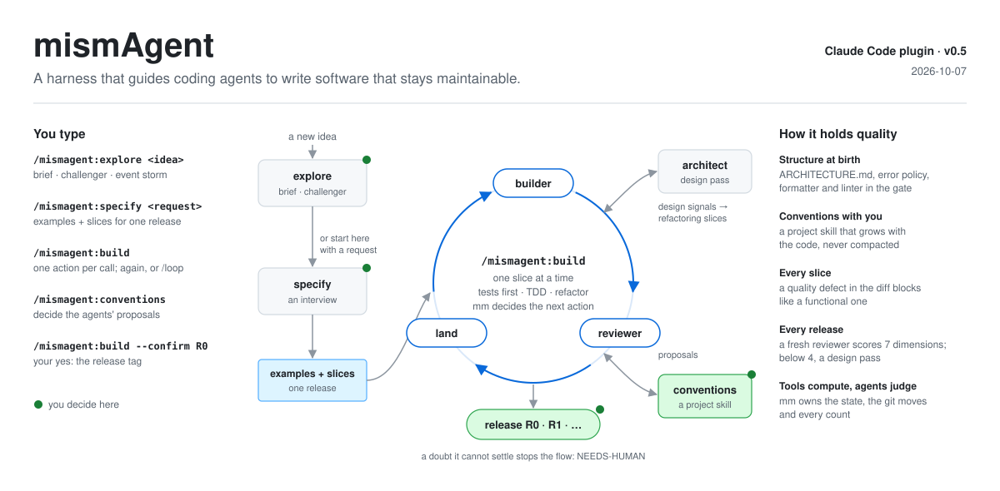

# mismAgent

**A Claude Code plugin that guides coding agents to write software that stays maintainable.**



## Start here

Requires Claude Code and **Python 3** (standard library only) for the tool `mm` and the hooks. The
repo root is the marketplace; register it with an **absolute path**:
```
/plugin marketplace add /absolute/path/to/this/repo
/plugin install mismagent@mismagent-method
/reload-plugins
```
On **Codex** or **pi** instead: `codex/install.sh <your-project>` or `pi/install.sh <your-project>`
([what changes](docs/PACKAGING.md#other-runtimes)).

Then, for a new product: `/mismagent:explore <idea>`, `/mismagent:specify R0`, and
`/mismagent:build` until it stops for you. For a change: `/mismagent:specify <request>`, then
`/mismagent:build`.

## Why

A single agent, given a small well-described problem, already delivers the features: in our
baseline, plain Claude Code built a cash register, a change request and a second feature in fifteen
minutes, passing 40/40 of an external acceptance. What it loses is what the text did not
ask for: refactoring, design, exploration, coherence across sessions — and on long projects that
loss compounds. mismAgent is for that: maintainable code, exploration, existing code, coherence
from the architecture to the code, light by default.

The thesis: **the code carries the theory of the program** (Naur); **XP** keeps it clean (simple
design, test first, refactoring always); **the human agrees concrete examples**; the harness keeps
both honest. Heir of **BMad** and **Agentheim**.

## The commands

| You type | What happens |
|---|---|
| `/mismagent:explore <idea>` | For a new product: a dialogue on the problem → a one-page brief; a fresh-context challenger tries to kill it (you decide: stop, reshape, go on); an event storm of the domain — the timeline of events, who does what, what can be undone, the hotspots. |
| `/mismagent:specify <request>` | An interview, not a transcription: real cases with real values, the edges you would not volunteer, each rule restated for you to confirm. Out: the stack decision (first time), `examples.md`, vertical slices for **the next release only**. |
| `/mismagent:build` | **One action per call**, decided by the tool `mm`: build a slice (acceptance tests first, TDD, refactoring), review it on the review table, land it, run a design pass, or stop for you. Run it again, or under `/loop`. |
| `/mismagent:build --confirm R0` | Your confirmation of a release: the tag. |
| `/mismagent:conventions` | When the conductor stops for it (after the model slice, and after any slice that did something new): you and the agent go through the agents' proposals one by one — create or update a topic of the project's conventions skill (`.claude/skills/conventions/`), or reject it. |
| `/loop /mismagent:build` (in a session of its own) | The always-on conductor: every action as soon as it is ready — build, review, land, design pass; when it needs you it waits and checks back every ten minutes, and resumes by itself once you have answered. |

You step in for the challenger's verdict, the examples, the stack, the project's conventions, an
important doubt (`NEEDS-HUMAN`) and each release.

## How it holds quality
- **Structure at birth:** the architect writes `ARCHITECTURE.md` before the first slice — layering,
  one owner per table, the error policy — and wires the sensors (formatter, linter, thresholds,
  suppression count) into the gate.
- **Conventions decided with you:** the model slice and every slice that does something new propose
  how code is written here; you decide each proposal, and the result is a project skill
  (`.claude/skills/conventions/`, rules with real files as examples) that the builder loads and the
  reviewer checks by. It grows with the code instead of being compacted.
- **Every slice:** acceptance tests at the use-case seam first, test-first to green, a refactoring
  pass, a commit at every green; a fresh reviewer blocks a quality defect in the diff exactly like a
  functional one.
- **Every release:** a fresh reviewer scores the whole code from 1 to 5 on the seven
  dimensions of the [review table](plugins/mismagent/skills/craft/references/review-table.md)
  (simple design, naming, modularity, duplication, concision, error handling, test quality); if any
  is below 4, the architect reads the code and queues refactoring slices before the next request. If
  one is still below 4 after two design passes, you decide whether to confirm the release, with
  the reason.
- **Tools compute, agents judge:** `mm` owns the state, the git moves and every count.

## The design, in three layers
| file | layer |
|---|---|
| [`v0.5-vision.md`](docs/rationale/v0.5-vision.md) | stable: purpose, thesis, lineage, the four loops, quality as a fixed point |
| [`v0.5-hypotheses.md`](docs/rationale/v0.5-hypotheses.md) | every mechanism as a hypothesis, with the experiment that confirms or refutes it |
| [`v0.5-core.md`](docs/rationale/v0.5-core.md) | the minimal core, what this plugin ships |
| [`v0.5-derivation.md`](docs/rationale/v0.5-derivation.md) | non-normative: how we got here |

The design keeps the name 0.5; the plugin ships as **0.7.x**, because builds numbered 0.5.0 and
0.6.0 of the earlier flow still sit in Claude Code's plugin cache, which is keyed by version.

The v0.26 flow (explore → model → worker-composer, parallel building blocks) is retired to
[`attic/v0.26/`](attic/v0.26/).

## Working on this repo
- `python3 -m unittest discover -s plugins/mismagent/tools/tests` — the tool, the hooks, the prompt
  budgets (operative prompts ≤ 5,000 words in all).
- `bench/` — measuring the harness on the product, against a baseline: `converse.py` (a builder and a
  simulated user in turns), `scenarios/baseline/` (plain Claude Code, the design-pass experiment),
  `scenarios/long-horizon/` (four change requests: does the code stay maintainable?), `score.py`,
  `cost.py`, `run.py`.
- `python3 -m unittest discover -s tools/tests` — the Codex and pi packagings: generated,
  installed into a fresh project, `mm` run there. `codex/` and `pi/` are generated by
  `tools/generate-codex.py` and `tools/generate-pi.py`; never edit them by hand
  ([packaging](docs/PACKAGING.md)).
- [`docs/one-page.svg`](docs/one-page.svg) is the page at the top: update it, and its date, whenever
  a command or the flow changes.
- `.claude/settings.json` refuses an agent's `git commit` without a `README.md` update —
  `[skip-readme]` in the message opts out when nothing a reader sees has changed.
