# mismAgent — pi packaging

> **GENERATED — do not edit.** Derived from `plugins/` by `tools/generate-pi.py`; the
> Claude Code plugin is the source of truth. Edit the source, then regenerate.

> **pi mapping (this packaging).** `[skill]`/`[command]` steps are pi **skills** — invoke with `/skill:mismagent-<name>` (pi also loads them on demand; names carry the `mismagent-` prefix because pi's skill space is flat). `[agent]` steps are **prompt templates** (`/mismagent-<name>`) that dispatch the matching subagent definition in `.pi/agents/` through the `subagent` tool (`agentScope: "both"`; every spawn is a fresh isolated context — the guarantee D1 relies on). The board script lives at `.agents/skills/mismagent-board/scripts/board.py`. The worker-composer's parallel waves map onto the subagent tool's parallel mode (max 8 tasks per call, 4 concurrent — see its skill's pi execution notes); `mismagent-reviewer` is generated glue hosting the `mismagent-code-review` skill in fresh context. pi has no per-agent reasoning knob — to think harder on the adversarial roles (challenger/verifier/architect), pin a stronger `model:` in their `.pi/agents/*.md`.


> **It is not a methodology to read: it is a flow to invoke.** The substance is the agents
> and the skills listed below — *their instructions are the process*. This file is only
> the map of what to invoke and in what order.
> Extended reasoning lives in the mismagent source repo
> (`plugins/mismagent/redesign/composer-spec.md`).
>
> **Core + profile.** mismAgent is **portable**: the core (agents, skills, flow) names no
> project. Each project provides its profile — **the active profile lives in
> `<output_dir>/profile.md`, default `.mismagent/profile.md`** (template: `.agents/skills/mismagent-explore/references/PROFILE.md`; filled-in
> example: `.agents/skills/mismagent-explore/references/profile-example.md`) — from which the agents read the sides, the repos, the gates, the
> dev-architecture skills, the boundary rules, the boundary projections and the commit format.
>
> **Handoff rule:** every handoff that crosses a movement is a **FILE** (e.g. the "Seeds for the
> tactical" in `features/<feature>/tactical-model.md`), never just a return message — movements may
> run in different sessions.

## Where things live — the trunk and the features (v0.13.0)

`<output_dir>` (default `.mismagent`) has **two levels**, and the split is the method's own
project/feature boundary. The **profile is the project's junction point**; a feature is a folder
that is added and thrown away without touching anything above it.

```
.mismagent/
  profile.md            # THE JUNCTION POINT — sides, repos, gate, projections, commit format
  context-map.md        # strategic: bounded contexts + ubiquitous language + relationships
  architecture.md       # the chosen style + module map + allowed dependency directions
  code-rules.md         # the deliberated code-writing rules, each with its enforcement channel
  infra-notes.md        # the deploy/infra context
  decisions/            # ADRs — scope: global | <side> | infra (never per-feature)
  architetture/         # architecture overview, dev-architecture per CODEBASE, api/ contracts
  features/
    <feature>/          # everything that is born and dies with this feature
      product-brief.md · tactical-model.md · building-blocks.yaml
      blocks/<ctx>/{todo,doing,done}/ · open-questions/ · tasks/
      UI/ · research/ · render-proof/ · gate-proof/
```

**The rule that follows from it, and the reason the split exists:** a signal is read at the scope
of the artifact it guards. A new feature's folder is empty *by construction*, so emptiness there
says nothing about whether the project has decided its stack. Reading a feature-local signal to
decide a project-level artifact is what made the architect re-deliberate the stack — and rewrite
the profile — on every new feature. Concretely:

- the **ubiquitous language** is amended in the one project map, never re-forked per feature
  (two maps = two sets of canonical names = the drift the verifier's greps exist to catch);
- the **foundational deliberation** (stack, style, code rules, `gate`, `run`) happens **once per
  project**; a later feature gets a *feature dispatch* that reuses the trunk, and changing a
  foundational decision is an explicit **amendment** (a superseding ADR), never a silent rewrite;
- **only the architect writes the trunk.** Analyst amends `context-map.md`; everyone else writes
  inside `features/<feature>/`.

*(Before v0.13.0 everything lived in `<output_dir>/<feature>/`, context-map included. Existing
projects: move the trunk files up, the rest under `features/<feature>/` — see the v0.13.0 note in
the repo README. There is no compatibility shim.)*

## The flow at a glance

```mermaid
flowchart LR
    subgraph EX["explore — you in dialogue"]
        direction TB
        dlg["in-session dialogue<br/>(+ profile bootstrap<br/>if missing)"]
        chal["mismagent-challenger<br/>fresh context<br/>KILL · RESHAPE · PROCEED"]
        res["mismagent-researcher<br/>gathers material<br/>(only if new)"]
        ana["mismagent-analyst<br/>strategic +<br/>ubiquitous language"]
        dlg --> chal
        chal -- "KILL /<br/>RESHAPE" --> dlg
        chal -- PROCEED --> res --> ana
    end

    subgraph MO["model — you confirm the boundaries"]
        direction TB
        tact["mismagent-tactical-modeler<br/>aggregates · invariants<br/>events · commands"]
        ux["ux-designer<br/>UI → views<br/>(if there is UI)"]
        arch["mismagent-architect, two-pass<br/>stack · style · infra · rules<br/>DELIBERATED with you<br/>ONCE PER PROJECT"]
        bman["build-manifest<br/>types PINNED · tests_nl<br/>scaffold · block files"]
        ccon["create-contract<br/>cross-deploy MODULE<br/>→ OpenAPI"]
        tact --> arch --> bman
        ux --> bman
        bman -. "if cross-deploy" .-> ccon
    end

    subgraph BU["build — you delegate; confirm at the end"]
        direction TB
        comp["/skill:mismagent-worker-composer<br/>owner-first waves · merge<br/>= composition · D2 weld"]
        wrk["mismagent-worker ×N<br/>block-type × projection<br/>+ side memory"]
        ver["mismagent-verifier (structural)<br/>+ code-review (semantic)"]
        comp --> wrk --> ver
        ver -- FAIL --> wrk
    end

    idea([raw idea]) --> dlg
    ana == "PROJECT context-map.md (amended)<br/>+ feature tactical-model.md" ==> tact
    bman == "building-blocks.yaml<br/>blocks · boundaries · projection" ==> comp
    ver -- PASS --> conf{{"you<br/>confirm"}}
    conf --> rel([green tag →<br/>feature flag])

    classDef human fill:#fff8c5,stroke:#d4a72c,stroke-width:2px,color:#24292f
    classDef step fill:#f6f8fa,stroke:#d0d7de,color:#24292f
    classDef term fill:#dafbe1,stroke:#2da44e,color:#24292f
    classDef movement fill:#ffffff,stroke:#afb8c1,stroke-dasharray:4 3,color:#57606a
    class arch,conf human
    class dlg,chal,res,ana,tact,ux,bman,ccon,comp,wrk,ver step
    class idea,rel term
    class EX,MO,BU movement
```



## explore → model → build

**explore** · *you in dialogue* — from raw idea to understood problem.
- skill **`/skill:mismagent-explore`** (you dialogue in session; **profile bootstrap** if missing:
  `output_dir` default `.mismagent` + language of the names) · subagent **`mismagent-researcher`**
  (explores the domain → `research/<topic>.md`, when the domain is new) · subagent
  **`mismagent-challenger`** (with fresh context tries to *demolish* the idea) · subagent
  **`mismagent-analyst`** (models the **strategic**: bounded contexts + **ubiquitous language** in the
  domain language + **seeds for the tactical** persisted in the context-map).
- explore→model gate: **PM-rigor** checklist: does the brief cover problem/user/value/scope?
- output: the strategic model + the canonical names + research material + the spikes.

**model** · *you confirm the boundaries* — from understood problem to manifest (+ contract if cross-deploy).

**One command conducts the whole movement: `/skill:mismagent-model <feature>`** `[command]` — it runs the
five steps below in order, stopping **only** at the human checkpoints (`NEEDS-INPUT` ambiguities ·
the stack/architecture/infra deliberation · the `tests_nl` elicitation), and resumes re-entrantly
at the first missing artifact. The step-by-step form stays equivalent:

*How to invoke it (in order). `[skill]`/`[command]` are pi **skills** — invoke with `/skill:mismagent-<name>`; `[agent]` is a **prompt template** — type `/mismagent-<name>` and it dispatches the subagent of the same name via the `subagent` tool. You can still ask pi to *"spawn `mismagent-X` via the subagent tool"* if you prefer the headless form.):*
1. **`/mismagent-tactical-modeler`** `[agent]` — completes the model: aggregates/invariants/events/
   commands per context (it starts from the context-map's "Seeds for the tactical").
2. **`/skill:mismagent-ux-designer`** `[skill]` — imagines the UI → views (only if there is UI).
3. **`/mismagent-architect`** `[agent]` — architecture + ADRs + boundaries with projection.
   **Foundational decisions deliberated WITH the user** via a **two-pass headless pattern** (it is a
   subagent, it can't talk to the user): pass-1 DISCOVERY writes nothing and returns
   `STACK_PROPOSAL` + `ARCH_PROPOSAL` (architecture style + quality drivers **+ the code-writing
   rules that follow from the style** — the dependency-lint per candidate stack, the contested
   knobs; catalogue from `write-code-rules`) + `INFRA_QUESTIONS`
   (deploy/data/retention/maintenance), the orchestrator brings them to the user, pass-2 WRITES the
   ADRs/architecture/infra-notes **and the user-visible project definition files** —
   `<output_dir>/architecture.md` (style + module map) and `<output_dir>/code-rules.md` (each rule
   with its enforcement: mechanical → the **gate's dependency lint**, discursive → code-review
   criteria, structural → cited owner), profile pointed at both — never a
   silent ADR. After the stack ADR it **finalizes the `gate` in the profile** (build + test + the
   dependency lint) **and the UI sides' `run` binding** (pinned a priori — a contract the wave-0
   scaffold must satisfy).
4. **`/skill:mismagent-build-manifest`** `[skill]` — the tactical → `building-blocks.yaml`:
   blocks + boundaries with **PINNED types** (Published Language) + projection + the user's `tests_nl`;
   in greenfield it also emits a **wave-0 `scaffold` block**. Besides the authoritative YAML it seeds
   the **rich, derived block files** (`blocks/<ctx>/todo/<id>.md`: spec + `## What to do`/`## Tasks`/
   `## Dependencies`, status-less, no checkboxes) so opening a block shows the whole block, **held to
   a per-type completeness standard** (invariants covered by criteria, commands with happy+failure,
   pinned signatures inlined — linted by the worker-composer's readiness, surfaced on the board).
   **You read them live via `/skill:mismagent-board`** (read-only).
5. **`/skill:mismagent-create-contract`** `[skill, from the cross-deploy module]` —
   **only if** at least one boundary is `cross-deploy`: the port is projected into ONE OpenAPI
   (names from the ubiquitous language). If the module is not enabled and you have no
   cross-deploy boundaries, this step does not exist.
- output: tactical model + **building-block manifest** (+ OpenAPI if cross-deploy) + ADRs.

**build** · *you delegate; confirm only at the end* — from manifest to released code.
- command **`/skill:mismagent-worker-composer <feature>`** — thin coordinator, the only one that merges and
  moves state: readiness on the manifest (pinned types, or BOUNCE to the model movement; **git present** — if the
  side's repo isn't a git repo, it `git init`s **with your confirmation**) → **wave-0 scaffold** first
  (greenfield: gate green on the empty skeleton) → *boundary-owner-first* waves → dispatches
  **`mismagent-worker`** ×N `[subagent]` (skill = block-type ×
  projection + the codebase's dev-architecture memory) → **D1** green on its own (fresh `mismagent-verifier` +
  `code-review`) → merge = composition → **D2** contract test on the welded boundary →
  **you confirm** → green release-tag = turn on the flag.
- output: code composed at the boundaries, deployed behind a flag.
- *(the file-driven flow — `/dev-orchestrator-v2`, `/project-orchestrator`, `mism-build-dag`,
  `mism-developer-lean`, `mism-dev-story-lean` — is superseded and lives in `attic/`, outside the
  registry: it is not invocable.)*

## Running it — the run-sheet (who types what)

Legend: `[skill]`/`[command]` are skills **you invoke** as `/skill:mismagent-<name>`; `[agent]` is a **prompt template you type** as `/mismagent-<name>` — it dispatches the subagent of the same name through the `subagent` tool (fallback: ask pi to *"spawn `mismagent-X` via the subagent tool"*). Every skill **not** named in this run-sheet (`write-*`, `realize-*`,
`seam-*`, `code-review`) is **internal** — invoked *by* the agents mid-flow, not a user entry point:
typed out of flow it has no block/context to work on.

**0 · Setup (once).** From the mismagent repo: `pi/install.sh <your-project-root>` (add `--with-cross-deploy` only if boundaries cross deploy units). It copies the skills into `<project>/.agents/skills/`, the prompt templates into `<project>/.pi/prompts/`, the subagent definitions into `<project>/.pi/agents/`, and this file as the project's `AGENTS.md` (or `AGENTS.mismagent.md` if one already exists — merge it). `[agent]` steps additionally need pi's official `subagent` example extension (pi repo, `packages/coding-agent/examples/extensions/subagent/` — symlink `index.ts` + `agents.ts` into `~/.pi/agent/extensions/subagent/`), always called with `agentScope: "both"`. Verify: `/skill:mismagent-explore` autocompletes. Alternative global install (skills+prompts only): `pi install <path-to-mismagent-repo>/pi`.

**1 · explore — you in dialogue (high presence).**
You type **`/skill:mismagent-explore <the idea in one sentence>`**. The skill: (step 0) if missing,
creates the bootstrap `.mismagent/profile.md` (output_dir, language of the names, sides); dialogues
with you; dispatches **`mismagent-challenger`** (KILL → stop · RESHAPE → redesign with you ·
PROCEED → go on), if needed **`mismagent-researcher`**, then **`mismagent-analyst`** (context-map +
"Seeds for the tactical"). It converges on the `product-brief.md`.
*Gate:* brief with problem/user/value/scope + context-map with the bounded contexts. → model.

**2 · model — you confirm the boundaries.**
You type **`/skill:mismagent-model <feature>`** — the conductor drives the five steps below and stops at
the checkpoints (you decide; it types). Or step-by-step, equivalently:
1. You type **`/mismagent-tactical-modeler`** → Tactical model in the context-map (it absorbs
   the Seeds); on `NEEDS-INPUT` it brings you the ambiguities, you decide.
2. *(if there is UI)* you type **`/skill:mismagent-ux-designer`** → concept with you → `UI/ux-proposal.md`.
3. You type **`/mismagent-architect`** → it presents the **stack/architecture/infra alternatives AND
   the code-writing rules with pros/cons and YOU choose** (never a silent ADR) → ADRs + boundaries
   with projection + **your project definition files in `<output_dir>`** — `architecture.md`
   (style + module map) and `code-rules.md` (each rule with its enforcement channel), yours to
   open and read — → it finalizes the `gate` in the profile (incl. the dependency lint) and the
   UI sides' `run` binding (pinned a priori: the wave-0 scaffold must satisfy it). In greenfield,
   **before the first domain wave**, it also **authors the codebase's dev-architecture** (the
   style memory — aggregate shape, test conventions — deliberated with you, pointed at by the
   profile, injected into every worker dispatch; the harvest later grounds it on real code).
4. You type **`/skill:mismagent-build-manifest`** → `building-blocks.yaml` (types PINNED at the
   boundaries); it **asks you for the `tests_nl`** in natural language for the high-value blocks, and
   seeds the **rich block files** in `blocks/<ctx>/todo/`. **Watch them live with `/skill:mismagent-board`.**
5. *(only if a boundary is cross-deploy with `contract_form: openapi`)* you type
   **`/skill:mismagent-create-contract`** → ONE OpenAPI. *(An `event-schema` wire's
   contract is its versioned schema files — ADR + manifest declare it; the scaffold creates it.)*
*Gate:* the worker-composer's **Phase 1** (the single survival-test gate) — optionally previewed early
with `/skill:mismagent-readiness-gate`. → build.

**3 · build — you delegate; confirm only at the end.**
Prerequisite: the side's repo is **under git** (the worker-composer lives on worktrees and merges) —
if it isn't, the worker-composer's Phase 1 `git init`s it **after asking you to confirm**.
You type **`/skill:mismagent-worker-composer <feature>`**. It: readiness (unpinned boundary →
BOUNCE to the model movement; git present) → **wave-0 scaffold** (greenfield: skeleton green on the gate) →
owner-first waves → dispatches **`mismagent-worker`** ×N → D1 (verifier +
code-review with fresh context) → merge = composition → D2 (contract test on the boundary) → loop.
You step in **only** if a worker returns `BOUNCED` (ambiguous AC — the block is parked in `todo/`
with the question in `open-questions/<block-id>.md`: you decide, then re-run
`/skill:mismagent-build-manifest` to fold the answer in) and **at the end**:
you confirm the release → green tag → feature-flag.
*Other build steps:* **`/skill:mismagent-run-app-smoke`** `[skill]` — the recorded render proof of `ui`
blocks (launches the app via the profile's `run`, evidence in `render-proof/`). **Not optional on a
manual-`ui_render_check` side: the worker-composer runs it itself at D1** when the proof is missing;
typing it yourself is the *slice-wide* re-proof before you confirm the release.
**`/skill:mismagent-harvest-dev-architecture`** `[skill]` *(optional)* — after the first green slice,
turns the done blocks' real conventions into the codebase's dev-architecture memory — grounding
the architect's authored doc, if one exists (the profile's `dev_architecture` stops being `none`).

**When it jams:** write the entry in the project's `MISMAGENT-LOG.md` *immediately* (which
skill/agent, what it was attempting, what broke, `core` vs `profile`) — that is how the method matures.

## The rules the flow ENFORCES (no human re-reads them: agents + CI apply them)
1. **state = the folder** (`todo/ doing/ done/`); `git mv` and merges only by the worker-composer.
2. **the boundary is executable**: every boundary has pinned types (Published Language) + contract
   tests (invariant-test on the aggregate · consumer-driven on the port); the cross-deploy contract
   exists **in the form the boundary declares** (`contract_form`: OpenAPI for request/response ·
   a versioned event-schema for replication/sync wires) — OpenAPI is one projection of the
   boundary, not its definition.
3. **no artifact that no machine downstream re-reads** — the one exception is a **derived view
   regenerated from a source** (e.g. the rich block files + the read-only `/skill:mismagent-board`, derived
   from the manifest): allowed because it is regenerated, never hand-maintained, so it cannot drift;
   its consumer is the human.
4. **every cross-movement handoff is a file**, never just a message. If the harness is in a
   **read-only/plan mode**, dispatch only read-only subagents (the challenger) and **materialize the
   pending files as the first action once writes reopen** — a plan's text is not a handoff (see
   the explore skill's "Harness read-only mode").
5. **release = tag ↔ feature-flag**: deploy per block (flag off), publish per tag.
6. **never merge/push onto the base branch without an explicit user request.**
7. **the core re-reads what it has already produced (re-entrance + reconciliation).** A command
   whose artifact already exists and is finalized never re-deliberates it: it says what exists and
   asks what to reopen (the conductor's resume-at-first-missing-artifact applies to every *single*
   command too — `/mismagent-architect` on a finalized feature must not re-propose decisions an
   adverse review already closed). And artifacts stay reconciled: an ADR that answers an open spike
   **backlinks the slug and closes it** in the context-map; an ADR that contradicts a context-map
   line **updates it or records the supersede** — two artifacts that disagree in silence are two
   sources of truth (friction-log-4 #9/#13/#14); build-manifest reconciles its pins with
   profile · architecture · ADRs before emitting (friction-log-4 #22).
8. **a gate that cannot go red is not a gate.** The profile's gate must **execute the tests it
   guards** — not merely build their modules — proven red-green once at wave 0 (the scaffold's
   failing probe) and re-run **cache-bypassed** by the verifier at every D1: a cached green proves
   *nothing changed*, not *the tests pass on this diff* (friction-log-4 #17/#31). Same doctrine
   for `enforced_by` rules: prohibition vs presence (wave-gated), comment-stripped, shell-portable,
   validated red AND green (friction-log-4 #19/#26/#35/#37/#49).
9. **what crosses a seam is PINNED, never invented in parallel.** The manifest pins the minting
   rule of every correlation key, the unit-vs-quantity granularity of what flows, the delivery
   guarantee folds design against, the source of every view field — and derives an **owner block**
   for every shared artifact ≥2 same-wave blocks consume (friction-log-4
   #25/#34/#38/#40/#41/#47/#48/#50): N parallel workers left to invent a shared convention produce
   N divergent ones, and the divergence detonates at the weld, not at the build.
