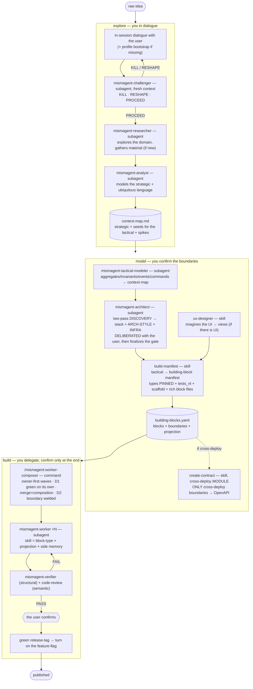

# mismAgent — the flow

> **It is not a methodology to read: it is a flow to invoke.** The substance is the agents
> and the skills listed below — *their instructions are the process*. This file is only
> the map of what to invoke and in what order.
> Extended reasoning: `redesign/composer-spec.md` (architecture-driven build);
> the superseded file-driven flow lives in `attic/` at the repo root (outside the registry).
>
> **Core + profile.** mismAgent is **portable**: the core (agents, skills, flow) names no
> project. Each project provides its profile — **the active profile lives in
> `<output_dir>/profile.md`, default `.mismagent/profile.md`** (template: `PROFILE.md`; filled-in
> example: `profiles/example.md`) — from which the agents read the sides, the repos, the gates, the
> dev-architecture skills, the boundary rules, the boundary projections and the commit format.
>
> **Handoff rule:** every handoff that crosses a movement is a **FILE** in
> `<output_dir>/<feature>/` (e.g. the "Seeds for the tactical" in the context-map), never just
> a return message — movements may run in different sessions.

## The flow at a glance

## explore → model → build

**explore** · *you in dialogue* — from raw idea to understood problem.
- skill **`/mismagent:explore`** (you dialogue in session; **profile bootstrap** if missing:
  `output_dir` default `.mismagent` + language of the names) · subagent **`mismagent-researcher`**
  (explores the domain → `research/<topic>.md`, when the domain is new) · subagent
  **`mismagent-challenger`** (with fresh context tries to *demolish* the idea) · subagent
  **`mismagent-analyst`** (models the **strategic**: bounded contexts + **ubiquitous language** in the
  domain language + **seeds for the tactical** persisted in the context-map).
- explore→model gate: **PM-rigor** checklist: does the brief cover problem/user/value/scope?
- output: the strategic model + the canonical names + research material + the spikes.

**model** · *you confirm the boundaries* — from understood problem to manifest (+ contract if cross-deploy).

*How to invoke it (in order). **Everything is a slash-command under `/mismagent:`** — `[skill]`/
`[command]` do the work directly; `[agent]` is a thin command that **dispatches the subagent of the
same name** (e.g. `/mismagent:architect` → the `mismagent-architect` subagent). You can still ask the
assistant to "dispatch `mismagent-X`" if you prefer the headless form.):*
1. **`/mismagent:tactical-modeler`** `[agent]` — completes the model: aggregates/invariants/events/
   commands per context (it starts from the context-map's "Seeds for the tactical").
2. **`/mismagent:ux-designer`** `[skill]` — imagines the UI → views (only if there is UI).
3. **`/mismagent:architect`** `[agent]` — architecture + ADRs + boundaries with projection.
   **Foundational decisions deliberated WITH the user** via a **two-pass headless pattern** (it is a
   subagent, it can't talk to the user): pass-1 DISCOVERY writes nothing and returns
   `STACK_PROPOSAL` + `ARCH_PROPOSAL` (architecture style + quality drivers) + `INFRA_QUESTIONS`
   (deploy/data/retention/maintenance), the orchestrator brings them to the user, pass-2 WRITES the
   ADRs/architecture/infra-notes — never a silent ADR. After the stack ADR it **finalizes the
   `gate` in the profile**.
4. **`/mismagent:build-manifest`** `[skill]` — the tactical → `building-blocks.yaml`:
   blocks + boundaries with **PINNED types** (Published Language) + projection + the user's `tests_nl`;
   in greenfield it also emits a **wave-0 `scaffold` block**. Besides the authoritative YAML it seeds
   the **rich, derived block files** (`blocks/<ctx>/todo/<id>.md`: spec + `## Cosa fare`/`## Task`/
   `## Dipendenze`, status-less, no checkboxes) so opening a block shows the whole block. **You read
   them live via `/mismagent:board`** (read-only).
5. **`/mismagent-cross-deploy:create-contract`** `[skill, from the cross-deploy module]` —
   **only if** at least one boundary is `cross-deploy`: the port is projected into ONE OpenAPI
   (names from the ubiquitous language). If the module is not enabled and you have no
   cross-deploy boundaries, this step does not exist.
- output: tactical model + **building-block manifest** (+ OpenAPI if cross-deploy) + ADRs.

**build** · *you delegate; confirm only at the end* — from manifest to released code.
- command **`/mismagent:worker-composer <feature>`** — thin coordinator, the only one that merges and
  moves state: readiness on the manifest (pinned types, or BOUNCE to IDEA-2; **git present** — if the
  side's repo isn't a git repo, it `git init`s **with your confirmation**) → **wave-0 scaffold** first
  (greenfield: gate green on the empty skeleton) → *boundary-owner-first* waves → dispatches
  **`mismagent-worker`** ×N `[subagent]` (skill = block-type ×
  projection + the side's dev-architecture + tier) → **D1** green on its own (fresh `mismagent-verifier` +
  `code-review`) → merge = composition → **D2** contract test on the welded boundary →
  **you confirm** → green release-tag = turn on the flag.
- output: code composed at the boundaries, deployed behind a flag.
- *(the file-driven flow — `/dev-orchestrator-v2`, `/project-orchestrator`, `mism-build-dag`,
  `mism-developer-lean`, `mism-dev-story-lean` — is superseded and lives in `attic/`, outside the
  registry: it is not invocable.)*

## Running it — the run-sheet (who types what)

Legend: **you type** the slash-commands — **all under `/mismagent:`**. `[skill]`/`[command]` do the
work directly; `[agent]` is a thin command that **dispatches the subagent of the same name**
(`/mismagent:architect` → the `mismagent-architect` subagent). Equivalent fallback: ask the assistant
to *"dispatch `mismagent-X`"*.

**0 · Setup (once).** `/plugin marketplace add <absolute-path-to-the-mismagent-repo>` →
`/plugin install mismagent@mismagent-method` → *(only if the project will have boundaries between
different sides)* `/plugin install mismagent-cross-deploy@mismagent-method` → `/reload-plugins`.
Verify: `/mismagent:explore` appears among the skills.

**1 · explore — you in dialogue (high presence).**
You type **`/mismagent:explore <the idea in one sentence>`**. The skill: (step 0) if missing,
creates the bootstrap `.mismagent/profile.md` (output_dir, language of the names, sides); dialogues
with you; dispatches **`mismagent-challenger`** (KILL → stop · RESHAPE → redesign with you ·
PROCEED → go on), if needed **`mismagent-researcher`**, then **`mismagent-analyst`** (context-map +
"Seeds for the tactical"). It converges on the `product-brief.md`.
*Gate:* brief with problem/user/value/scope + context-map with the bounded contexts. → model.

**2 · model — you confirm the boundaries.**
1. You type **`/mismagent:tactical-modeler`** → Tactical model in the context-map (it absorbs
   the Seeds); on `NEEDS-INPUT` it brings you the ambiguities, you decide.
2. *(if there is UI)* you type **`/mismagent:ux-designer`** → concept with you → `UI/ux-proposal.md`.
3. You type **`/mismagent:architect`** → it presents the **stack/architecture/infra alternatives with
   pros/cons and YOU choose** (never a silent ADR) → ADRs + boundaries with projection → it finalizes
   the `gate` in the profile.
4. You type **`/mismagent:build-manifest`** → `building-blocks.yaml` (types PINNED at the
   boundaries); it **asks you for the `tests_nl`** in natural language for the high-value blocks, and
   seeds the **rich block files** in `blocks/<ctx>/todo/`. **Watch them live with `/mismagent:board`.**
5. *(only if a boundary is cross-deploy)* you type
   **`/mismagent-cross-deploy:create-contract`** → ONE OpenAPI.
*Gate:* the worker-composer's **Phase 1** (the single survival-test gate) — optionally previewed early
with `/mismagent:readiness-gate`. → build.

**3 · build — you delegate; confirm only at the end.**
Prerequisite: the side's repo is **under git** (the worker-composer lives on worktrees and merges) —
if it isn't, the worker-composer's Phase 1 `git init`s it **after asking you to confirm**.
You type **`/mismagent:worker-composer <feature>`**. It: readiness (unpinned boundary →
BOUNCE to IDEA-2; git present) → **wave-0 scaffold** (greenfield: skeleton green on the gate) →
owner-first waves → dispatches **`mismagent-worker`** ×N → D1 (verifier +
code-review with fresh context) → merge = composition → D2 (contract test on the boundary) → loop.
You step in **only** if a worker returns `BOUNCED` (ambiguous AC: you decide) and **at the end**:
you confirm the release → green tag → feature-flag.

**When it jams:** write the entry in the project's `MISMAGENT-LOG.md` *immediately* (which
skill/agent, what it was attempting, what broke, `core` vs `profile`) — that is how the method matures.

## The rules the flow ENFORCES (no human re-reads them: agents + CI apply them)
1. **state = the folder** (`todo/ doing/ done/`); `git mv` and merges only by the worker-composer.
2. **the boundary is executable**: every boundary has pinned types (Published Language) + contract
   tests (invariant-test on the aggregate · consumer-driven on the port); the OpenAPI exists only
   as the **cross-deploy** projection of the boundary.
3. **no artifact that no machine downstream re-reads** — the one exception is a **derived view
   regenerated from a source** (e.g. the rich block files + the read-only `/mismagent:board`, derived
   from the manifest): allowed because it is regenerated, never hand-maintained, so it cannot drift;
   its consumer is the human.
4. **every cross-movement handoff is a file**, never just a message.
5. **release = tag ↔ feature-flag**: deploy per block (flag off), publish per tag.
6. **never merge/push onto the base branch without an explicit user request.**
